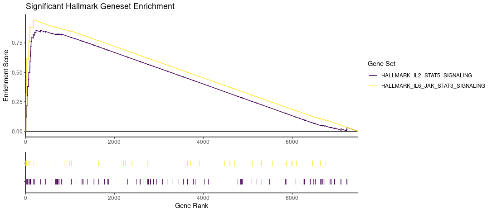
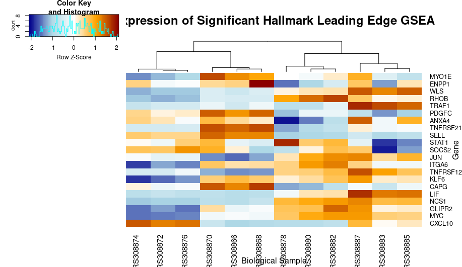

# NixSEA-package

R package for easy Gene Set Enrichment Analysis (GSEA) calculation and visualization directly downstream of DESeq2 RNA-seq pipeline. 

Install with the following:

```ruby
install_github("Stefanos-Apostle/NixSEA-package")
library(NixSEA)
```




